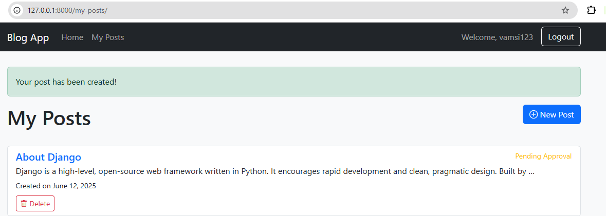
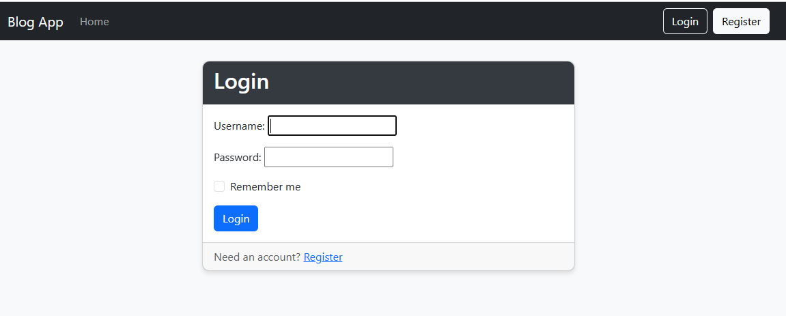
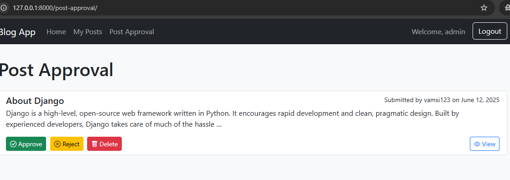

# 📝 Multi-User Blog with Comments and Permissions

A Django-based blog application that allows users to submit posts and comment on approved content, while admins can manage posts with various permissions.

## 🚀 Features

- **User Roles**:
  - **Users** can:
    - Register/login/logout
    - Submit blog posts
    - View their submitted posts
    - Comment on **approved** posts
  - **Admins** can:
    - Approve, reject, or delete blog posts

- **Post & Comment System**:
  - Posts have statuses: `pending`, `approved`, or `rejected`
  - Comments only allowed on approved posts

- **Extras** (Bonus):
  - Pagination on the blog listing
  - Search bar for finding posts by title/content
  - Email notifications sent on post approval

## 🛠️ Tech Stack

- **Backend**: Django
- **Frontend**: HTML, CSS (Bootstrap)
- **Database**: SQLite

## 📸 Screenshots

### ✅ Home Page (Post List)

### 📝 Login Page

### 🔐 Register Page

### 🧑‍💼 Admin Panel (Approve/Reject)

## 📦 Project Structure

